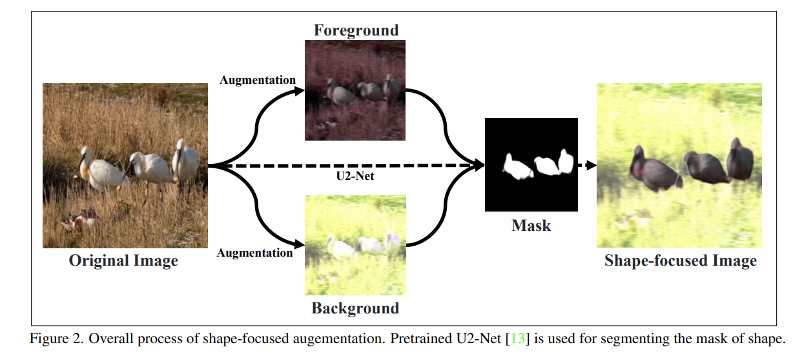
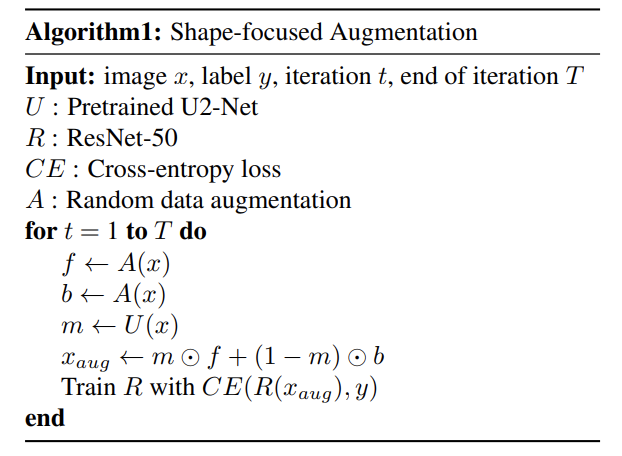
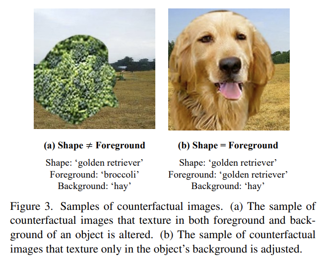
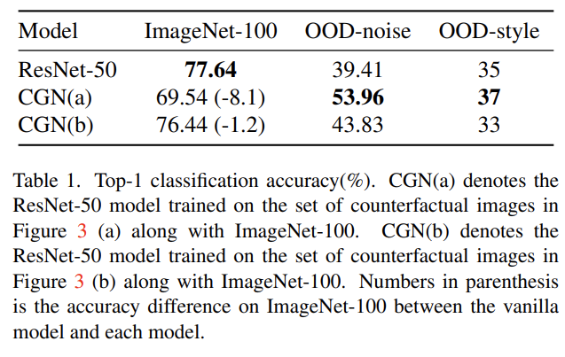
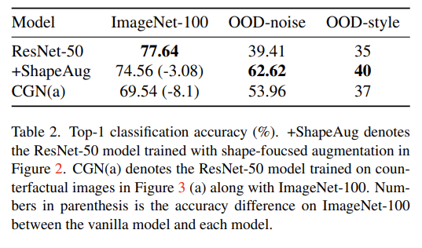
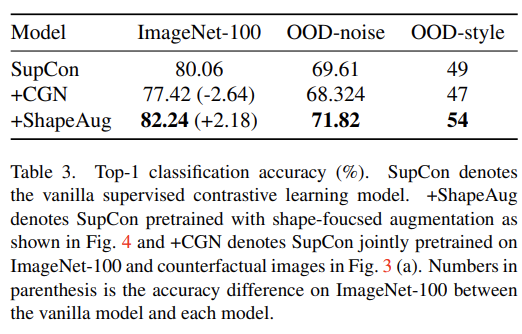
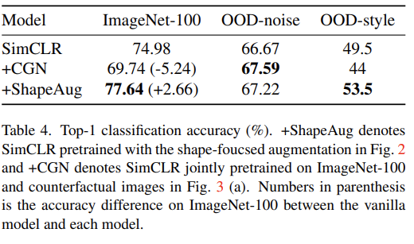

# Improving Robustness to Texture Bias via Shape-focused Augmentation, CVPR 22

논문 리딩 일시 : 23.12.11

## 뭐하는 논문인가?

이전 논문에서, ImageNet pretrained CNN이 texture 정보에 biased 된다는 단점을 확인함. 이 연구에서는 이 현상을 개선하기 위해서 이미지의 스타일을 변경하여 해결하였음. 하지만, 이는 in-domain 성능을 희생하여 OOD 성능을 올리는 현상을 보였다. 

본 논문의 motivation은, in-domain과 OOD 의 성능을 함께 올리고 싶었던 것에서 출발, shape object mask를 활용하여 object와 배경에 다른 texture 정보의 변화를 적용하는 것으로 shape-focused augmentation을 제안. 

결과적으로 제안된 방법이 texture-bias를 경감 시킴과 동시에 in-domain의 성능 또한 유지 하는것을 확인함. 

## 전체 리뷰 

## I. Introduction 

### DNN이 biased 되기 쉬우며 주로 texture-biased model이 될 가능성이 크다. 

최근 DNN이나 CNN이 기존 typical한 학습 과정에서 shallow correlation에만 biased 된다는 것을 여럿 확인해 왔음. [1-3] 

예를 들자면, [1] ImageNet 학습된 CNN은 texture biased 된다는 현상이 보고됨. Texture-biased 모델은 OOD 에 취약할 수 있음 [4] 

### texture 정보를 변경하여 이를 해결하려 시도했으나, In-domain 성능은 종종 무시되어 왔다. 

이를 해결하기 위해 이전 연구들에서는 **texture 정보를 변경**해 이미지를 새로 생성하여 **texture-debiased** 되게 만듦[5,6].

**이는 texture와 label 간의 binding을 약하게 만들기 위한 목적도 있음**

- Geirhos et al. [5] : Stylelized ImageNet으로 texture reandomization 수행 

- Sauer-Geiger et al. [6] : Counter-factual Generative network(CGN), 배경과 object 의 texture를 클래스 별로 차이나게 생성함 

**그러나 앞선 방법들은 in-domain의 성능은 고려하지 않았음. 성능 하락이 반드시 수반됨.** 

이러한 semantic 정보를 잘 고려하지 못한 전체적인 texture 변경은 자칫 이미지의 semantic 정보를 손실하게 만들어 in-domain의 성능을 떨어트릴 우려가 있음 

본 논문에서는  레이블과 이미지 텍스쳐 간 상관관계를 없애기 위해서  물체의 안과 밖에 서로 다른 텍스쳐 정보를 바꿀 수 있는 augmentation을 수행함. (ColorJitter, RandomGrayscale, RandomGaussianBlur, **역주: 참고로 [이 논문](https://proceedings.neurips.cc/paper_files/paper/2020/file/db5f9f42a7157abe65bb145000b5871a-Paper.pdf) 에서 이러한 spatial augmentation이 shape-bias를 늘리는데 도움을 줄 수 있다고 밝힘**) 

## II. Method

### Shape-focused Augmentation 

매우 간단하고 직관적인 방법임 

- Random hrizontal flip, Random crop 수행 (기본)

- 2개의 이미지로 복사 후 서로 다른 augmentation 수행 (독립적으로 서로 다른 augmentation을 추출 )
    
    - ColorJitter

    - RandoGrayscale

    - RandomGaussianBlur 

- 마스킹(pre-traiend U-Neet이용) 후 합침 

#### 알고리즘 

굉장히 간단한 알고리즘으로 Cross Entropy로 일반적인 이미지 분류 학습 기법에 적용함. 

### II.1. Drastic adjustment of texture 가 미치는 영향 분석 

CGN의 방법을 활용하여 counterfactual 이미지들을 생성 

위 컨셉 실험을 통해 다음과 같은 사실들을 경험적으로 도출 

1. 배경만을 바꾼 경우 in-domain 성능의 하락폭이 적어지면서 OOD 성능이 향상됨 

2. 그러나 배경과 물체 동시에 texture를 변경한 경우가 가장 높은 OOD 성능을 달성 

3. **Indomain 성능을 유지하면서 OOD 에도 robust하게 만드려면 semantic texture information을 어느정도 유지해야함을 알 수 있음** 

### II.2. Shape-focused augmentation의 효과 

이전 findings 

- Hermann et al. 이 [7]에서 텍스쳐 정보를 변경하는 것이 모델을 더 shape-biased 되게 만든 다는 것(특히 RGBJitter 등 texture 정보만 변경하는 경우가)을 발견. 

- Sauer-Geiger et al. 이 [6]에서 실루엣 정보를 이용해 물체와 배경에 서로 다른 텍스쳐 정보를 입히는 것을 제안(사실상 이 논문과 거의 유사). 그러나 여기에서는 물체와 배경에 모두 다른 클래스의 텍스쳐를 입힘. 

앞서 소개된 shape-focused augmentation을 적용한 결과
   

이전 방법 보다도 더 OOD에서 높은 성능을 보임, 또한 in-domain에서의 성능하락이 더 적음을 알 수 있음 

그런데 이건 당연한거 아닌가? 진짜 OOD가 아니라 노이즈나 스타일 변경만 한건데**, 원래 OOD를 만들 knowledge와 유사한걸 만들었으니 잘되겠지... in-domain 정보가 유지되는 것은 원래 object의 texture를 유지했기 때문일 거고. PACS나 이런 DG 데이터셋에서 실험했어야지 

그밖에 장점을 소개하는데, 뭐 plug-in manner기 때문에 모델 아키텍쳐 변경 없다, 기존 방법은 stylized image 만들어야하는데 이건 실시간으로 만들 수 있다 등등 있음. 

### Results 

그냥 CGN을 조금 바꾼 뒤 3 head로 학습하는 것 보다 더 성능을 올리기 위해서 기존에 있었던 contrastive learning에 붙여봄. SupCON에 shape focused augmentation을 붙였더니 서능이 더 향상됨. 

Self-supervised learning 중 하나인 SimCLR에도 적용해봄. 

여기서는 OOD-noise에 대해서만 근소하게 CGN에 뒤지고 나머지는 모두 상회. 

 

## References

[1] R. Geirhos, et al., "Shortcut learning in deep neural networks", Nature Machine Intelligence, 2020. 

[2] J. Jo et al., "Measuring the tendency of cnns to learn surface statistical regularities", arxiv, 2017.

[3] Beery S., "Recognition in terraincognita", ECCV, 2018. 

[4] S. Ringer et  al., "Texture bias of cnns limits feww-shot classification performance", arxiv, 2019.

[5] R. Geirhos, et al., "Imagenet-trained cnns are biased towards texture; increasing shape bias improves accuracy and robustness", ICLR, 2018.

[6] A. Sauer et  al., "Counterfactual generative networks", ICLR, 2021

[7] Hermann et al., "The origins and prevalence of texture bias in convolutional neural networks", NEULIPS, 2020.