# Style Neophile: Constantly Seeking Novel Styles for Domain Generalization, CVPR 22 

논문 리딩 일시 : 23.11.27 ~ 11.28 

## 뭐하는 논문인가?

기존의 Domain shfit를 다루는 논문들 중에서 style representation으로 이를 설명하려는 논문들에서는 *입력 이미지의 스타일로 도메인 특성을 모델링 할 수 있다* 라는 가정을 세워 성능을 향상 해왔음. 때문에 입력 데이터들을 가지고서 *스타일 정보를 잘 조작해서* augmentaiton 하는 방식으로 특정 도메인(style)에 de-biased 된 모델들을 획득해 왔음. 

하지만 기존 방법들은 그냥 스타일을 섞거는 등의 방식으로 **deterministic한 style representation($\mu(x), \sigma(x)$)을 인터폴레이션[1] 했기 때문에 diversity에 대한 limitation이 있었음**. 이로 미루어 보아 가정하면, 만약 **training dataset이 매우 style diversity가 떨어질 경우 큰 효과를 보기 어려웠음.** 자연스럽게, 입력 데이터의 영향을 덜 받도록 style representation을 잘 생성 할 수 있는 것이 관심을 받아 왔음(다시 말하면, 입력 style representation의 diversity를 잘 늘리는 법, 그런데 semantic을 잘 유지하면서). 

이 논문에서는 이 방법을 고민해 보고, 특히 학습과정에서 **모델이 업데이트 되며 점점 바뀌어 져 가는 feature map의 statistics를 이용해 보면 어떨까?**(기존에는 과거와 현재 고려 x, 현재 배치내에서만 수행) 라는 생각에서 출발. 

학습을 거치면서 observation된 style 들과 비교해 그것과 멀어 지도록 style representation을 생성/추출 함으로써 **과거의 학습 과정에서 보지 못했던 새로운 스타일을 생성**하는데 집중한 논문. 

## 전체 리뷰 

## I. Introduction 

- CNN remarkable solution이나 도메인 변화에 취약, DA(Domain Adaptation)가 있으나, target data 필요하다는 단점 존재 

- DG는 타겟 도메인 데이터가 필요하다는 단점을 보완할 수 있어 최근 각광받고 있음. DG중에서도 최근 style augmentation 기법들이 큰 관심을 받고 연구되고 있음. 그러나, 지금까지의 논문들에서는 제한된 스타일 만을 이용해 augmentation 한다는 한계가 존재(배치 샘플링 기반 인터폴레이션[1] 또는 외부 이미지 이용[2,3]).

- 본 논문에서는 이 문제를 다음과 같이 해결하려 시도함. **학습 과정에서 업데이트 되는 (한번 관찰한) style representation에서 최대한 먼 스타일을 생성 하고자 함 (소스 도메인과도 멀어지면서)**.

- 제안된 방법은 다음과 같음.

[1] 전체 소스 데이터를 잘 설명하고 있는 style representation의 몇개의 prototype을 추출, queue에 insert

[2] 학습 과정에서 feature statistics에 랜덤 노이즈 섞어서 style representation candidates들을 생성 

[3] 이들 중 prototype, 이전에 샘플링한 candidates들과 멀리 떨어진 style들을 샘플링 (score function 정의해 사용) 

[4] 생성된 style 들을 queue에 insert

위 과정의 반복 

- 이를 통해 SOTA 성능을 달성

## II. Method 

### 이쪽 연구의 가장 큰 assumption 

Feature statistics가 style representation이고, 이 style representation은 입력 데이터가 어느 도메인에서 왔느냐에 달려있음. style augmentation을 통해서 style-invariant한 모델을 학습해 style-invariant 한 representation을 얻을 수 있다면, un-seen domain에 대해서도 잘 generalize 할 수 있는 모델을 얻을 수 있다. 

### II.1. Main motivation 

모델이 학습할 때 항상 전에 보지 못했던 스타일의 입력을 얻을 수 있도록 하자! 

### II.2. Overview 

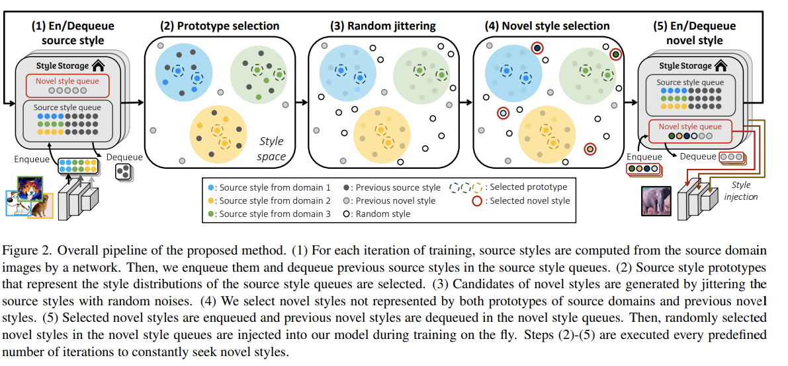

이쪽 연구에서 가장 먼저하는 style representation의 정의[1]를 먼저 설명함

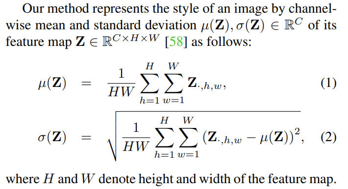

앞선 개념을 구현하기 위해서는, 기존에 획득된 스타일들의 distribution을 approximation 해야함. 이를 위해서 본 논문에서는 2개의 queue를 이용해 이를 측정 : **Source style queues**, **Novel style sueues**.

1. Source style queue : 최근 관측된 소스 이미지들의 스타일을 저장 

2. Novel style queue : source style queue와 novel style queue에 저장 된 style representation들과 **멀리 떨어진 style 들을 저장**

당연히 각 queue는 $\mu(Z)$와 $\sigma(Z)$ 를 따로 구분해서 저장함, Queue이므로 오래된 스타일은 제거될 수 있음. 

### II.3. Novel style synthesis 

Novel style을 생성하기 위해서 다음과 같은 2개의 중요한 criteria가 있음 

- Diversity : 생성된 style은 기존 관측된 style 들과 멀어야 함

- Plausible : 그러나 생성된 style들이 기존 source real image와 너무 멀어져 버리면 안됨. 즉 semantic은 유지하면서 스타일이 변형 되어야 함

### II.3.a. Prototype selection 

Source style queue 안에서 $m_{p}$개의 프로토타입들을 선택함. **이들을 고를 때 에는 distribution을 잘 설명할 수 있는 style 들을 추출함**

**어떤 방식으로 프로토타입들이 원본 distribution을 잘 설명할 수 있는지를 알 수 있을까?** 

여기서는 [4]의 연구를 참고하여 DA 에서 많이 활용되는 metric인 MMD(Maximum Mean Discrepancy)를 이용함.

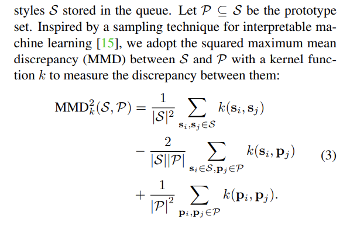

### MMD 에대한 간단한 note

간단히 보면, 추출된 스타일 셋인 $P$는 당연히 원래의 Source style queue set인 $S$의 서브셋임. 

MMD 는 두 분포간 차이를 측정하는 distance라는 개념임. 

먼저 가장 간단한 예인 first-order MMD를 살펴 보겠음. 

$MMD (P,Q) = || \mathbb{E}_{X \sim P} [\varphi(X)] - \mathbb{E}_{Y \sim Q} [\varphi(Y)]||_{\mathcal{H}}$
 
위와 같이 어떤 분포 P와 Q간의 거리를 측정해야할 때, 우리는 그 데이터를 대표하는 어떤 subset을 추출하여 이들간의 거리를 비교할 수 있음. 여기서 $\varphi$ 는 입력을 어떤 차원으로 보내는 함수라고 볼 수 있음. 

왜 이함수를 쓸까요? 나중에 내적을 연산해야 하는데 입력 차원이 너무 크면 내적 연산의 복잡도가 너무 올라가게 됨, 그래서 이를 저차원으로 보내는 함수라고도 볼 수 있음(커널 트릭). 예전에는 잘 설계된 function을 설계했으나, 이제는 Deep NN이 이를 잘 수행할 수 있다고 여겨짐. 

만약 $\varphi$가 입력을 잘 설명할 수 있는 embedding space로 보낼 수 있다면, 입력의 $\mu, \sigma^{2}$만 으로도 그 분포의 차이를 잘 설명할 수 있다는 말임. 

예를 들자면 만약 $\varphi$가 identity면 위 MMD 식은 단순히 입력 셋 간의 $\mu$의 차이를 distance로 나타낸 식이라고 볼 수 있음.

즉 다시 보면은, 결국 MMD 라는 것은 **각 분포로 부터 샘플링된 subset에 대해 그것을 어떤 embedding space로 보내는 함수에 의해서 획득된 abstract distibution간의 어떤 stat을 추출하고, 이 stat 간의 거리를 측정해 그 분포가 서로 얼마나 차이가 있는지를 본다고 할 수 있는 것임.** 이를 통해서 그 분포 간의 abstract한 차이를 수치화 할 수 있음!. stat은 fisrt order statistics를 쓸지, second order statistics를 쓸지는 쓰기 나름.

second-order MMD의 경우... 

Sopecifically, letting $k(x,y) = <\varphi(x), \varphi(y)>_{\mathcal{H}}$  

$MMD^{2} (P,Q) = || \mathbb{E}_{X \sim P} [\varphi(X)] - \mathbb{E}_{Y \sim Q} [\varphi(Y)]||^{2}_{\mathcal{H}}$

$=$ 

$<\mathbb{E}_{X \sim P} [\varphi(X), \mathbb{E}_{X' \sim P} (\varphi (X'))>_{\mathcal{H}}$

$+<\mathbb{E}_{Y \sim Q} [\varphi(Y), \mathbb{E}_{Y' \sim P} (\varphi (Y'))>_{\mathcal{H}}$

$-2<\mathbb{E}_{X \sim Q} [\varphi(X), \mathbb{E}_{Y \sim P} (\varphi (Y))>_{\mathcal{H}}$

여기서 X~P와 X'~P의 차이, 그리고 Y~Q와 Y'~Q의 차이는 resampling, 즉 동일한 분포에서 서로 다른 셋을 샘플링 한 것임 

여기서 kernel trick을 사용하면 (내적)

$k(x,y) = <\varphi(x), \varphi(y)>$

$MMD^{2} (P,Q) = || \mathbb{E}_{X \sim P} [\varphi(X)] - \mathbb{E}_{Y \sim Q} [\varphi(Y)]||^{2}_{\mathcal{H}}$

$=$ 

$\mathbb{E}_{X,X' \sim P} k(X, X') $

$+\mathbb{E}_{Y,Y' \sim Q} k(Y, Y') $

$-2\mathbb{E}_{X \sim P, Y \sim Q} k(X, Y) $

의 형태로 정의됨. 

즉 위의 정의와 동일함 (expectation을 풀어볼 시). 

### 가장 representative 한 style set을 추출하는 방법

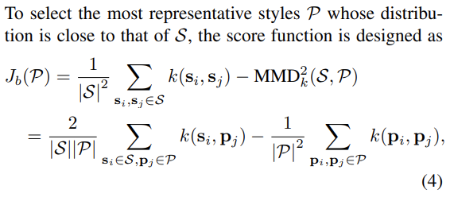

당연히 어떤 subset $P$를 $S$로 부터 샘플링 했을 때 이게 얼마나 원분포와 가까운가에 대한 score function을 만들어야 하고, 이 score를 maximize 해야 함. 

자세한 설명은 [4]를 참고하면 되고, 위 $J_{b}$의 두 term 에대해서 원 분포와 그 서브셋 간의 **negative** $MMD^{2}_{k}$를 보면 알 수 있듯이, 서브셋이 원분포와 멀면 멀수록 가중치가 들어간다고 보면됨(negation이기 때문). 앞의 term은  $J_{b}(\phi)$ 가 항상 0으로 나오게 하기 위해 추가된 것이라고 [4]에 증명 되어 있음. 

**다시 말해 $J_{b}$ score가 크면 정의 그자체로 그냥 두 분포가 멀어졌다고 볼 수 있음**

그러니까 당연히 $J_{b}$ 가 maximized 되도록 $P$를 샘플링하면 그게 representative 한 style set을 추출하는 거라고 볼 수 있음 

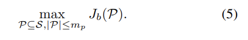

그런데 maximization problem이 intractable 하다는 문제가 있어서 optimal solution을 찾는게 거의 불가능함[5]. 그래서 greedy 한 접근법으로 near-optimal solution을 찾는다고함. 이부분은 코드를 참고해야 할 듯. 여기서 커널 함수 k가 RBF kernel일 경우 near-optimal solution을 찾는 것을 보장한다고 [4]에 증명 되어 있음. 거창하게 써 놓았지만, 그냥 [4]의 방법을 하나도 안바꾸고 그대로 가져다 쓴거라고 생각하면 됨.

### II.3.b. Random Jittering 

앞 section에서는 prototyle subset $\mathcal{P}$를 샘플링하는 방법을 다루어 보았음. 여기서 부터는 given source style set $\mathcal{S}$를 가지고 어떻게 random style set $\mathcal{D}$를 생성하는지 설명하고 있음. 

간단히 말하자면 원본에 노이즈를 섞는 가장 간단한 방법을 사용함. 그래서 논문에도 몇줄 안써져 있음.

먼저 추출된 style set 의 $\sigma$를 연산함. 

그리고 그 $\sigma$를 이용해 가우시안 노이즈를 injection함.

$\mathcal{N}(0, \lambda diag(\sigma(\mathcal{S})))$

여기서 $\lambda$ 는 sclable hyper parameter로 얼마나 노이즈를 추가할지를 결정함. 

### II.3.c. Novel style selection 

앞서 살펴본 바와 같이, 이제는 이번 학습때 사용할 novel style을 고를 때임. 

이때는 앞서 overview에서 설명한 바와 같이, 기존 source domain을 잘 설명하는 prototype style들인 $\mathcal{P}$와 이전 iteration 까지 생성된 style 들인 $\mathcal{V}$들의 합집합과 최대한 거리가 먼 스타일을 선택 해야 할것임. 이전에 관측한 스타일들과 거리가 먼 것을 novel style candidate들의 quality라고 생각했을 때, withness function은 다음과 같이 정의될 수 있음

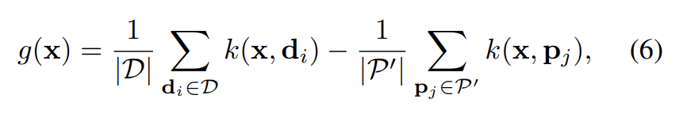

복잡해 보이지만, 생각보다 간단함. 

앞서 $\mathcal{D}$는 이전 스타일이라고 했음. 

첫번째 term이 나타내는 바는 입력과 이전 스타일 들간의 similarity(내적 연산) 들의 평균 이라고 보면 됨. **즉 이 term은 작아야함.** 

두번째 term 이나타내는 바는 입력과 프로토타입들(source domain을 가장 잘 설명하는 스타일들) 간의 similarity 들의 평균 이라고 보면 됨. **즉 이 term 은 커져야함**

**즉 $g(x)$가 minimized 되어야 하는데... 논문에는 반대로 적혀있음. 오타거나 내가 이해를 반대로 했거나... 저 수식에 -만 붙이면 될텐데...**

어쨋든 논문에선 $g(x)$를 maximize 한다고 되어 있음. 

### II.4. Training with novel styles 

먼저 일반적인 style augmentation과 같이 style 정보를 없애주는 작업을 함.

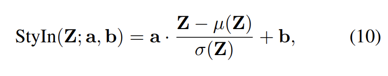

그다음엔 입력된 style representation으로 affine transform 해주는건 똑같음(수식 10 참고바람). 

기존 mixstyle과 마찬가지로 여러 resnet layer에 적용 가능함. 그것은 design selection. 

이제부터는 loss term에 대한 설명임.

**1. 당연히 cross entropy 사용됨.** 

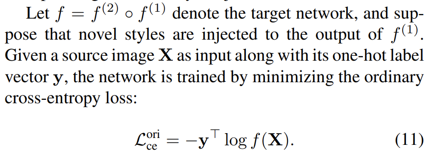

**2. style injection 한 네트워크의 cross entropy를 따로 줌. (기존 mixstyle과 다른점)**

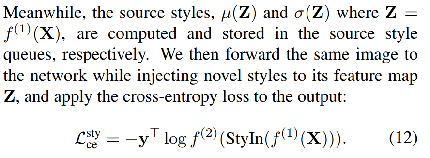

**3. style augmentation 안한 prediction을 soft target으로 사용함 (self KD?)**

뭔가 self-KD와 같이, style augmentation 안한 버전에 temperature를 씌워서 soft target 으로 활용. 

이를 통해 consistency를 유지했다고함, 즉 너무 스타일이 튀는것을 방지? 했다고도 보여짐, 모델 가중치 업데이트에서 너무 튀는 것을 방지. 

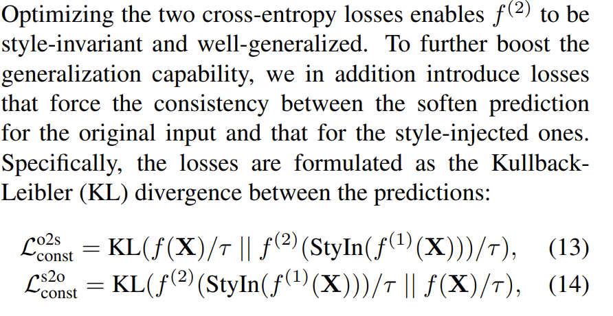

이게 reguralization term 과 같은 역할을 하는 것으로 보임. 

이렇게 할거면 Jenson Shannon Divergence는 왜 안썼을까? 

**4. total loss term**

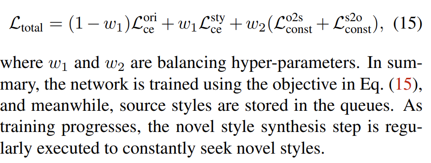

제안된 loss term을 융합. 

original cross entopy + novel style injected cross entropy 는 convex combination. 

뒤에 KLdiv로 consistecy를 유지하기 위한 regularization term 이 추가됨. 

## References

[[1] Kaiyang Zhou, et al., Domain generalization with mixstyle, *ICLR*, 2021.](https://arxiv.org/abs/2104.02008)

[[2] Namyup Kim et al., Wedge: Web-image assisted domain generalization for semantic segmentation, *ICRA*, 2023.
](https://ieeexplore.ieee.org/abstract/document/10160999/)

[[3] Xiangyu Yue et al., Domain randomization and pyramid consistency: Simulation-to-real generalization without accessing target domain data, *ICCV*, 2019.](https://openaccess.thecvf.com/content_ICCV_2019/html/Yue_Domain_Randomization_and_Pyramid_Consistency_Simulation-to-Real_Generalization_Without_Accessing_Target_ICCV_2019_paper.html)

[[4] Been Kim et al., Examples are not Enough, Learn to Criticize! Criticism for Interpretability, *NIPS*, 2016.](https://proceedings.neurips.cc/paper/2016/file/5680522b8e2bb01943234bce7bf84534-Paper.pdf)

[[5] George L Nemhauser, et al. An analysis of approximations for maximizing submodular set functions-i. *Mathematical programming*, 14(1)](https://link.springer.com/article/10.1007/BF01588971)

