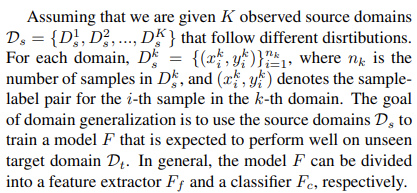
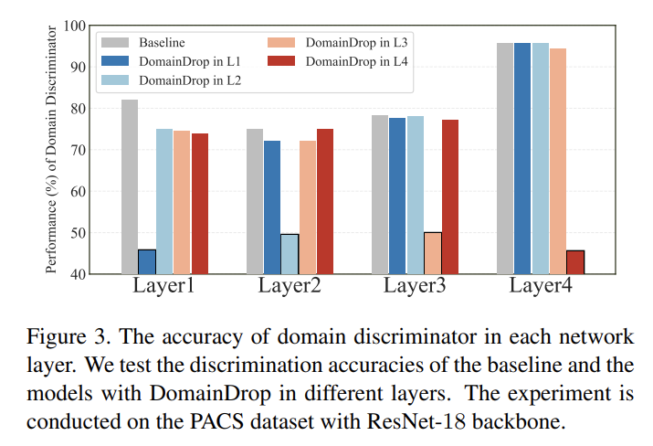

# DomainDrop: Suppressing Domain-Sensitive channels for Domain Generalization, *ICCV* 2023

리딩 : 2023.12.04

## 뭐하는 논문인가 

예전부터 source domain 에서 높은 성능을 달성하던 모델이 OOD(Out Of Domain) 에서 망하는 경우는 종종 있어 왔고, 이를 해결하기위해 DG(Domain Generalization)을 수행해 왔음. 

이 논문에서는 새로운 관점에서 DG 문제를 해쳐 나가려고 함. <span style='color:red'>**어떤 채널은 도메인 변화에 큰 영향을 받고, 어떤 채널은 도메인 변화에 덜 영향을 받는다**</span>는것을 확인하고, <span style='color:red'>**불안정한 채널을 adaptive 하게 drop**</span> 함으로써 DG 성능을 향상시켰다 라는 논문임. 


[작성자 주석] 

예전부터 Style Augmentation 에서는 <span style='color:red'>**Channel-wise** $\mu, \sigma$ </span>를 이용해서 스타일 정보를 변경해 왔음. 

관련 내용 : [Mixstyle](https://arxiv.org/pdf/2104.02008.pdf), [Style Neophile](../cvpr22_style_neophile/content.ipynb), [DSU](https://arxiv.org/abs/2310.17942)

이전부터 각 CNN의 컨볼루션 채널은 어떠한 필터를 상징하게 되고, 이 필터가 잘 학습 되면, 각각의 어떤 특징을 추출할 수 있는 잘 설계된 필터에 가까운 역할을 한다는 믿음이 있었음. (denoising autoencoder 에서 self-supervised learning을 통해 잘 학습된 embedding의 컨볼루션 채널들이 가버 필터와 유사한 형태를 띈다는 초기 연구에서부터 최근까지.. )

또, 최근엔 이미지넷 사전학습된 CNN들은 텍스쳐에 biased 된 다는 경향이 있다는 것도 밝혀짐

그렇다면, 어떤 필터는 텍스쳐 정보를 더 추출할 수 있는 필터고, 어떤 필터는 shape 정보를 더 잘 추출할 수 있을것임. 

**또, 일반적으로는 도메인 영향을 많이 받는 특징은 텍스쳐임. 따라서, 어떤 특정 필터가 도메인 변화의 영향을 더 많이 받을 가능성이 높음**

그래서 위 논문이 좋다는 생각. 


## 전체 리뷰 

### 3.1. Setting and overview 

맨날 하는 소리를 장황하게 써 놓았음 그래서 그냥 그대로 첨부함. 





- Domain discriminator for channel suppressing : 이어지는 내용에서는 그냥 일반적인 cross entropy로 학습했지만, 학습 과정에서 domain discriminator로 domain-sensitive 한 channel 를 surppressing 하는 방향으로 학습을 진행. 여기서는 예전부터 DA에서 활용되던 domain discriminator를 활용. domain discriminator가 domain-sensitive channel들을 제거하는 역할을 함.

- Layer-wise training scheme : 또한, 저자들은 각 레이어 별로 서로 다른 채널들이 domain-sensitive함을 확인하고 layer-wise training scheme을 적용.  

- Consistency loss : 

### 3.2. Suppressing Domain-Sensitive Channels 

<span style='color:red'>**그냥 중간단계 레이어에 각각 DANN[1] 해준것에 지나지 않음**</span>

중간 단계 레이어 들에서 domain discriminator를 설정하여 unstable한 채널들을 찾고 이를 suppression함. 

GAP이용해 feature map dimension reduction 수행. 이후 FC를 연결해서 classification 하는 아주 일반적인 구조로 구성됨. 

어떤 특정 레이어 위치에서 주어진 입력이 $x^{k}_{l}$일 때, 입력 feature map이 $F_{l}(x^{k}_{l}) \in \mathbb{R}^{C \times H \times W}$ 으로 표현 한다. 그리고  $F_{l}(x^{k}_{l})$는 domain discriminator $F^{l}_{d}$에 입력됨. 

domain discriminator $F^{l}_{d}$의 목표는 domain classification임(**즉 multi-domain generalization에서만 활용 가능.**). domain prior가 없으면 활용 불가, 당연히 GRL(Gradient Reversal Layer) 활용됨(**그냥 typical한 DANN 임**). 하기 loss term이야 DANN 그대로 쓴거고.. 


### Distinguish domain-sensitive channels 

여기서부터가 아이디어. 

<span style='color:red'>**어떤 채널이 domain-specific information을 모델링하는지 알 수 있었을까?**</span>

저자들은 mid-layer의 discriminator의 성능으로 channel importance를 모델링 했다고 함. 

<span style='color:red'>**가설: domain discriminator의 예측에 가장 contribution이 큰 채널들이 domain-specific할 것이라고 예상**</span>

복잡하게 써 놓았지만 원리는 간단하다. 

[코드를 살펴보자.](https://github.com/lingeringlight/DomainDrop/blob/main/models/LayerDiscriminator.py) 

공개된 코드를 재구성함. 원래 discriminator의 FC의 weight은 $N_{d} \times C$ 임($N_{d}:number of domain$)

이것을 domain label 에 알맞는 output score(prediction confidence)를 선택한 다음 배치 사이즈만큼 복사. 이후 모든 입력 feature map의 element에 대해서 weighting 할 수 있을 만큼 복사하고 (BxCxWxH) 나서 서로 곱하는 과정을 거침. <span style='color:red'>**즉 domain discriminator가 높은 확률로 도메인 분류를 성공한 경우 더 큰 가중치를 입력 피처에 준다는 뜻.** </span>

<span style='color:red'>**이후 이 score를 channel-dim 에 대해서 normalization 해 준다면 도메인 분류에 가장 큰 컨트리뷰션을 한 채널을 수치화 할 수 있음(이 경우, domain-specific channel이 됨)**</span>


```python
import torch
import torch.nn as nn
import torch.nn.functional as F
import random

def scores_dropout(scores, percent):
    mask_filters = filter_dropout_channel(scores=scores, percent=percent, wrs_flag=1)
    mask_filters = mask_filters  # BxCx1x1
    return mask_filters

def norm_scores(scores):
    score_max = scores.max(dim=1, keepdim=True)[0]
    score_min = scores.min(dim=1, keepdim=True)[0]
    scores_norm = (scores - score_min) / (score_max - score_min)
    return scores_norm

def get_scores(weights, feature, labels, percent=0.33):
    # weights :  num_domains x C
    domain_num, channel_num = weights.shape[0], weights.shape[1]
    batch_size, _, H, W = feature.shape[0], feature.shape[1], feature.shape[2], feature.shape[3]

    weight = weights[labels].view(batch_size, channel_num, 1).expand(batch_size, channel_num, H * W)\
        .view(batch_size, channel_num, H, W)
    right_score = torch.mul(feature, weight)
    right_score = norm_scores(right_score)

    # right_score_masks: BxCxHxW
    right_score_masks = scores_dropout(right_score, percent=percent)
    return right_score_masks

def mask_selection(scores, percent, wrs_flag):
    # input: scores: BxN
    batch_size = scores.shape[0]
    num_neurons = scores.shape[1]
    drop_num = int(num_neurons * percent)

    if wrs_flag == 0:
        # according to scores
        threshold = torch.sort(scores, dim=1, descending=True)[0][:, drop_num]
        threshold_expand = threshold.view(batch_size, 1).expand(batch_size, num_neurons)
        mask_filters = torch.where(scores > threshold_expand, torch.tensor(1.), torch.tensor(0.))
    else:
        # add random modules
        score_max = scores.max(dim=1, keepdim=True)[0]
        score_min = scores.min(dim=1, keepdim=True)[0]
        scores = (scores - score_min) / (score_max - score_min)
        
        r = torch.rand(scores.shape)  # BxC
        key = r.pow(1. / scores)
        threshold = torch.sort(key, dim=1, descending=True)[0][:, drop_num]
        threshold_expand = threshold.view(batch_size, 1).expand(batch_size, num_neurons)
        mask_filters = torch.where(key > threshold_expand, torch.tensor(1.), torch.tensor(0.))

    mask_filters = 1 - mask_filters  # BxN
    return mask_filters

def filter_dropout_channel(scores, percent, wrs_flag):
    # scores: BxCxHxW
    batch_size, channel_num, H, W = scores.shape[0], scores.shape[1], scores.shape[2], scores.shape[3]
    channel_scores = nn.AdaptiveAvgPool2d((1, 1))(scores).view(batch_size, channel_num)
    # channel_scores = channel_scores / channel_scores.sum(dim=1, keepdim=True)
    mask = mask_selection(channel_scores, percent, wrs_flag)   # BxC
    mask_filters = mask.view(batch_size, channel_num, 1, 1)
    return mask_filters

avgpool = nn.AdaptiveAvgPool2d((1, 1))
model = nn.Linear(64, 2) # channel 64, num domain 2 
softmax = nn.Softmax(0)
num_channels=64
percent=0.33

x = torch.zeros([4, 64, 56, 56])  # BxCxHxW
feature = x.clone()
x = avgpool(x)
x = x.view(x.size(0), -1)  # BxC
y = model(x)

labels = torch.zeros([4]).long()

# This step is to compute the 0-1 mask, which indicate the location of the domain-related information.
# mask_filters: {0 / 1} BxCxHxW
mask_filters = get_scores(
    weights= model.weight.clone().detach(),
    feature=feature, 
    labels=labels, 
    percent=percent
)
```

### Droping domain-sensitive channels 

앞서 어떤 channel이 domain-specific 한지 모델링 했으므로, 이 정보를 이용해 suppression을 할 차례이다. 

각 채널에 대한 scores의 합 대비 현재 채널의 score의 비율을 확률로 하여 dropout 시킨다. (코드 참고)


<span style='color:red'>**score $s_{j}$ 가 높으면 높을 수록 drop될 확률이 높다.**</span> 


### Remark 

확실히 이전 DG 연구들과 차별성이 있음, 이전 방법들은 back prop때 학습을 통해 domain invariant feature가 학습되는 반면, **domain drop은 forward pathway에서 이루어진다는 큰 차이점이 있음.** 따라서 feature augmentation 기법이라고도 볼 수 있다. 


### 3.3. Layer-wise Training Scheme 

예전부터 CNN의 각 단계에서 서로 다른 레벨의 정보를 인코딩 한다는 믿음이 있어왔음. 본 논문에서도 같은 방식으로 여러 단계의 레이어에서 domain drop을 수행. 이전 dropout은 주로 마지막 레이어나 high-level feature에 가까운 단에서 수행 되었음. 최근 연구들[2,3] 에서는 낮은 단계의 layer에서 추출된 피쳐들이 더 domain-specific한 특징을 가지고 있고, domain gap을 줄이기 위해 이곳을 건드려야 한다고 했음. 

그러나 이전 방법들은 일부 레이어에서만 이를 수행, **이 논문에서는 모든 레이어에 channel dropout을 적용 했음을 어필함. 마치 베이지안NN 동작하는것 같은데...**

어쨋든, resnet은 4개의 레이어로 구성되어져 있음. 각 레이어의 domain discriminator의 성능이 말해줄 수 있는 몇가지 사항들을 논문은 주장하고 있다. 



1. Baseline 성능을 보면, domain discriminator가 못해도 75%를 넘는 성능을 보이는 것을 보아, 상당한 domain gap이 존재함을 알 수 있음 

2. Domain Drop을 각 레이어 위치에 넣었을 때 discriminator 성능이 많이 떨어지는 것을 알 수 있음 (40~50%) 이는 domain gap이 효과적으로 줄어들었음을 의미 (ex. Layer1 - DomainDrop in L1, Layer2 - DomainDrop in L2 등.)

3. 또한 이러현 경향이 레이어별로 균일하게 나타나는 것으로 보아, high-level, low-level 구분하지 않고 domain drop이 잘 동작하는 것을 알 수 있음.

4. 한번에 모든 레이어의 채널을 드랍하는게 아니라, 랜덤하게 하나의 레이어의 채널을 드랍함으로써 과도한 dropout으로 인한 정보 손실, 그리고 그로 인한 학습 방해 부작용을 최소화 

### 3.4. Enhancing Domain-Invariant channels

Consistency regularization loss term임. self-supervised learning에서도 많이 쓰고.. 하여튼 넣으면 좋은 term 

랜덤 경향에 따라서 생성되는 mask가 달라질 수 있으므로, 2번 인퍼런스해서 soft target으로 KL divergence 먹여준다는 흔하디 흔한 loss term 


### 3.5. Theoretical Analysis of DomainDrop 

upper bound 증명, 생략. 

## Reference 

[1] [Ganin, Yaroslav, et al. "Domain-adversarial training of neural networks." The journal of machine learning research 17.1 (2016): 2096-2030.](https://www.jmlr.org/papers/volume17/15-239/15-239.pdf)

[2] [Baifeng Shi et al., "Informative dropout for robust representation learning: A shape-bias perspective", ICML, 2020](http://proceedings.mlr.press/v119/shi20e/shi20e.pdf)

[3] [Bo Geng, et al., "Daml: Domain adaptation metric learning", TIP, 2011](https://ieeexplore.ieee.org/stamp/stamp.jsp?arnumber=5740601)


                            